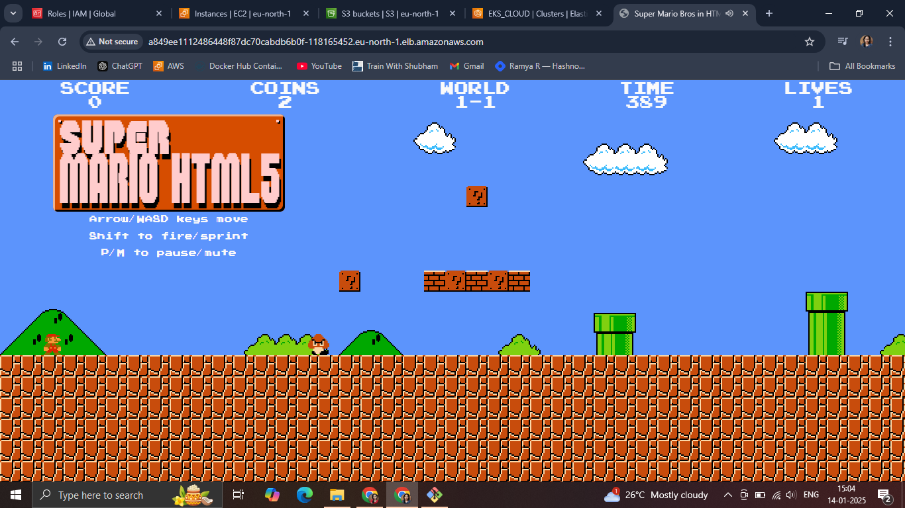
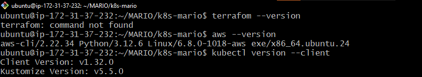
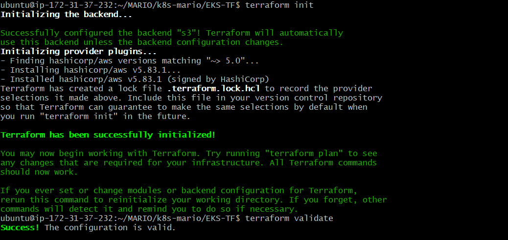
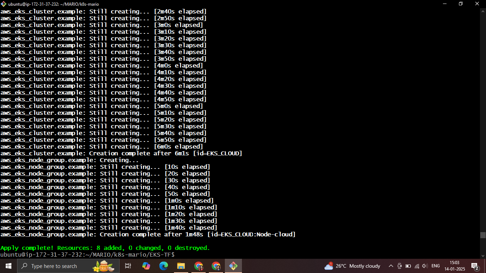
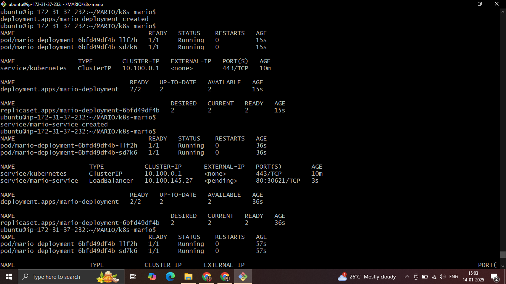
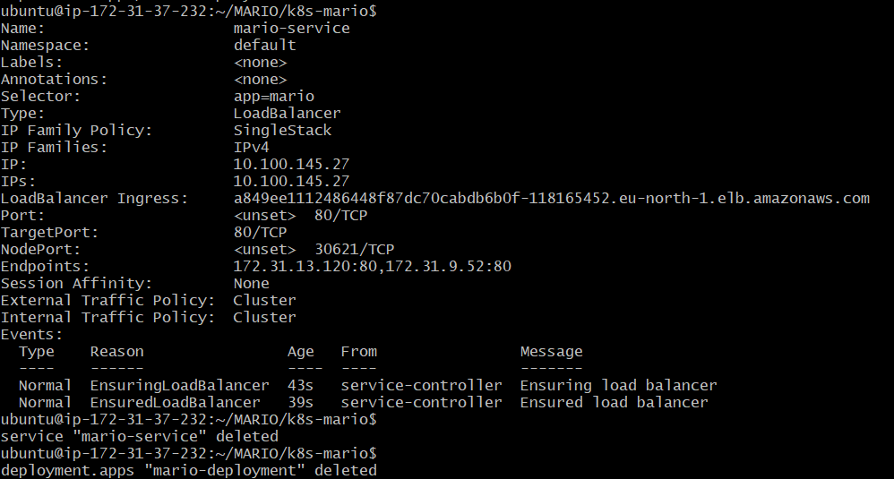

# Super Mario Game Deployment on AWS EKS

## Project Overview

This project demonstrates a fun and interactive deployment of a **Super Mario Game** on an AWS Elastic Kubernetes Service (EKS) cluster. The entire AWS infrastructure is provisioned and managed using **Terraform**, showcasing Infrastructure as Code (IaC) practices for automating resource creation.

## 🔗 Live Demo

Experience the app live: [AstroPlanet Live Demo](https://github.com/Ramya-R74/super-mario-eks.git)



The project is designed to:
- Deploy the Super Mario game as a Kubernetes application.
- Utilize Terraform for creating a scalable, production-ready AWS environment.
- Offer a simple and easy-to-replicate deployment process.

## Features
- **Infrastructure as Code:** Automated setup using Terraform for AWS resources.
- **Kubernetes Deployment:** Application deployed on an AWS EKS cluster.
- **Scalable Architecture:** Designed to support traffic spikes.
- **Modern Practices:** Use of managed Kubernetes (EKS) for deployment.

## AWS Resources Created
Using Terraform, the following AWS resources are provisioned:
1. **VPC:** A Virtual Private Cloud with subnets, route tables, and an internet gateway.
2. **EKS Cluster:** A managed Kubernetes service for hosting the Super Mario game.
3. **Node Group:** EC2 instances managed by EKS for running Kubernetes workloads.
4. **IAM Roles:** IAM roles and policies for EKS and worker nodes.
5. **Security Groups:** Secure networking for the cluster and the game.

## Prerequisites
Ensure the following tools are installed on your system:
- [Terraform](https://www.terraform.io/downloads)
- [kubectl](https://kubernetes.io/docs/tasks/tools/)
- [AWS CLI](https://docs.aws.amazon.com/cli/latest/userguide/install-cliv2.html)



You also need:
- An AWS account.
- Proper IAM permissions to create and manage AWS resources.

## Deployment Steps

### 1. Clone the Repository
```bash
git clone https://github.com/Ramya-R74/super-mario-eks.git
cd super-mario-eks
```

### 2. Initialize Terraform
Navigate to the `terraform` directory and initialize Terraform:
```bash
cd EKS-TF
terraform init
```


### 3. Configure Variables
Update the `terraform.tfvars` file with your desired AWS region and other configuration parameters:
```hcl
aws_region = "eu-north-1"
cluster_name = "super-mario-cluster"
instance_type = "t3.medium"
```

### 4. Apply Terraform Configuration
Run Terraform to provision the infrastructure:
```bash
terraform apply --auto-approve
```


Confirm the changes when prompted. This step will create the necessary AWS resources.

### 5. Update kubeconfig
Use the AWS CLI to update your `kubeconfig` for connecting to the EKS cluster:
```bash
aws eks --region <your-region> update-kubeconfig --name super-mario-cluster
```

### 6. Deploy the Super Mario Game
Apply the Kubernetes manifest files to deploy the game:
```bash
kubectl apply -f deployment.yaml
kubectl apply -f service.yaml
```


### 7. Access the Game
Retrieve the service's public URL:
```bash
kubectl get svc mario-service
```


Open the external IP in your browser to play the Super Mario game!

## Directory Structure
```
.
├── terraform
│   ├── main.tf         # Main Terraform configuration
│   ├── variables.tf    # Input variables
│   ├── outputs.tf      # Outputs
│   └── terraform.tfvars # Customizable variables
├── k8s
│   ├── deployment.yaml # Kubernetes deployment manifest
│   ├── service.yaml    # Kubernetes service manifest
└── README.md           # Project documentation
```

## Clean-Up
To avoid unnecessary costs, destroy the resources when you're done:
```bash
terraform destroy --auto-approve
```

## Future Enhancements
- Integrate CI/CD pipelines for automated deployments.
- Use Helm charts for easier Kubernetes deployments.
- Add autoscaling for the EKS node group.

## Acknowledgements
- [Terraform](https://www.terraform.io/)
- [AWS EKS](https://aws.amazon.com/eks/)
- [Super Mario Game](https://example.com/super-mario)

---
Enjoy playing Super Mario on your scalable AWS infrastructure!
